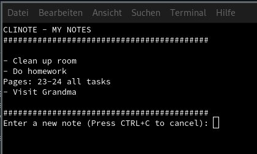

# CLINOTE
An open source lightweight and simple notes app for GNU/Linux. Perfect for Window Managers like i3wm, dwm etc. Syncing with cinnamon desktop also possible.



Notice: This program no longer supports Windows.
# Requirements
- Git
- Build-essential (Debian based only)
# Installation
Clone the repository and run the install script:
```
git clone https://github.com/JBGMR/CLINOTE.git && cd CLINOTE && sh install.sh
```
# Resetting the notes
To reset the .NOTEFILE run:
```
notes-reset
```
# Syncing with Cinnamon Desktop
It is possible to sync the .NOTEFILE with the Notes addon in Cinnamon. Under the desklet settings just change the source file to .NOTEFILE (You might have to press CTRL+H to view hidden files first).
